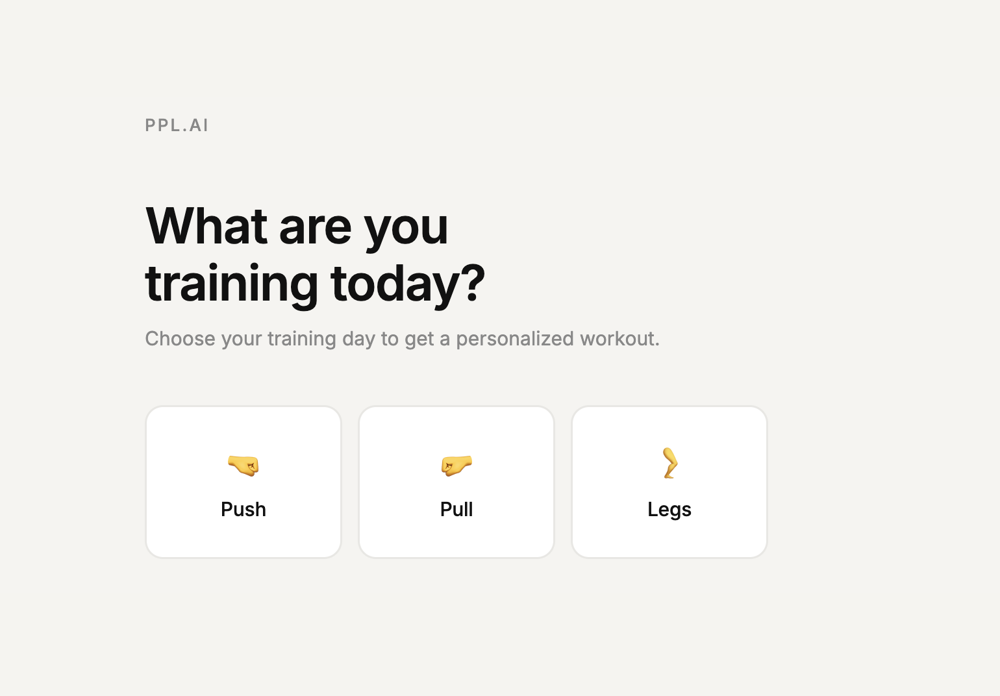

# ppl.ai

A minimalist AI-powered workout planner for beginner lifters.



**[→ Live at ppl-ai.vercel.app](https://ppl-ai.vercel.app)**

---

## What it does

Pick your training day — Push, Pull, or Legs — choose your focus, and get a tailored workout instantly.

Select **Aesthetics** on Push or Pull day to unlock AI physique analysis: upload a photo of your physique and Claude will identify your specific weak points and generate a custom 5-exercise workout targeting them.

## Features

- Push / Pull / Legs day selection
- Focus modes: Aesthetics, Strength, Explosiveness, Endurance
- AI physique analysis powered by Claude's vision API (Push & Pull — Aesthetics)
- Drag-and-drop or click-to-upload photo input
- Minimalist, mobile-friendly design

## Tech stack

- Vanilla HTML, CSS, JavaScript (no frameworks)
- Node.js + Express for local development
- [Anthropic Claude API](https://www.anthropic.com) (`claude-sonnet-4-6`) for vision-based physique analysis
- Deployed on [Vercel](https://vercel.com) via serverless functions

## Running locally

1. Clone the repo and install dependencies:
   ```bash
   npm install
   ```

2. Create a `.env` file in the project root:
   ```
   ANTHROPIC_API_KEY=your_api_key_here
   ```

3. Start the development server:
   ```bash
   npm run dev
   ```

4. Open [http://localhost:3000](http://localhost:3000)
